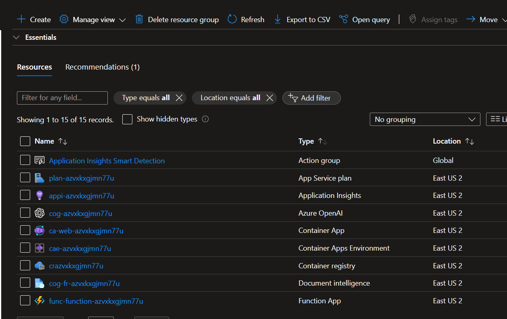
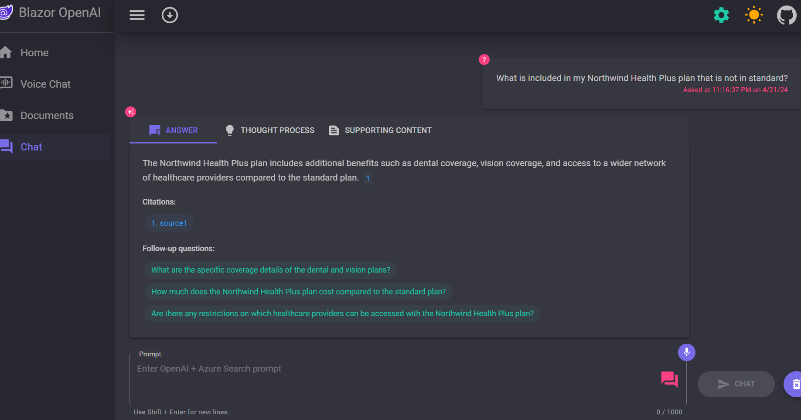
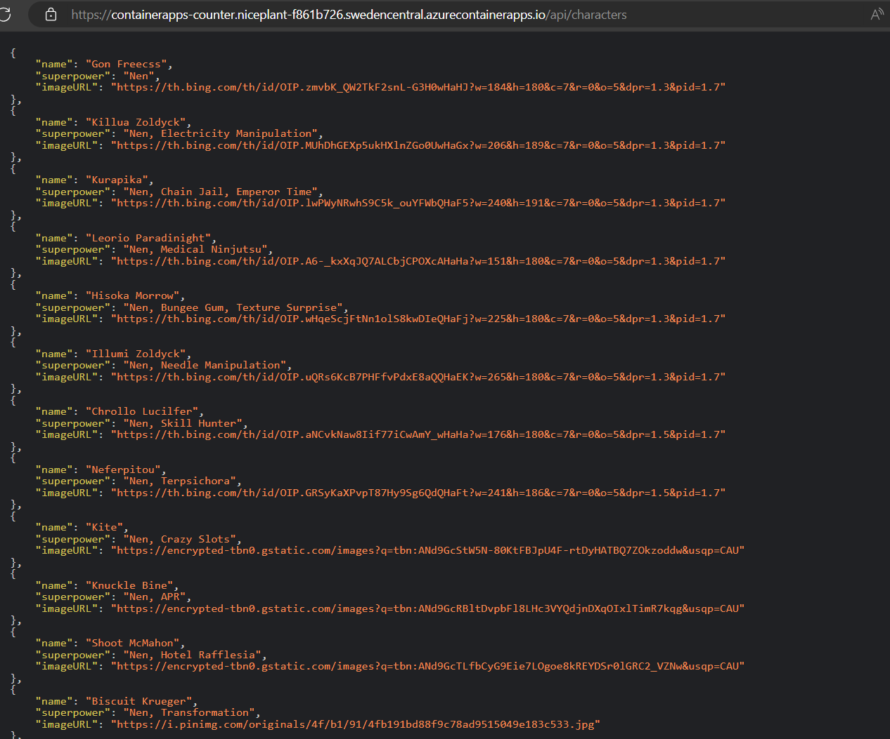
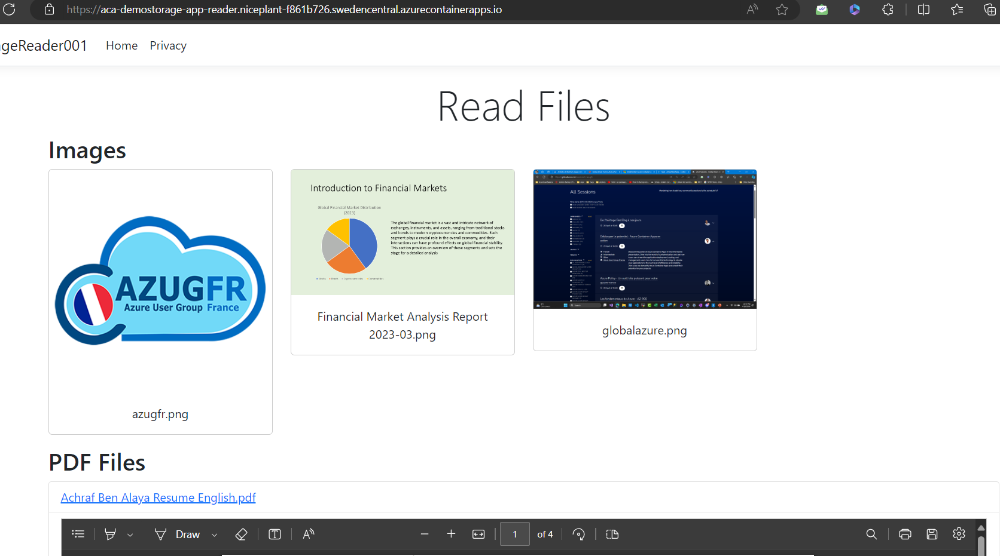
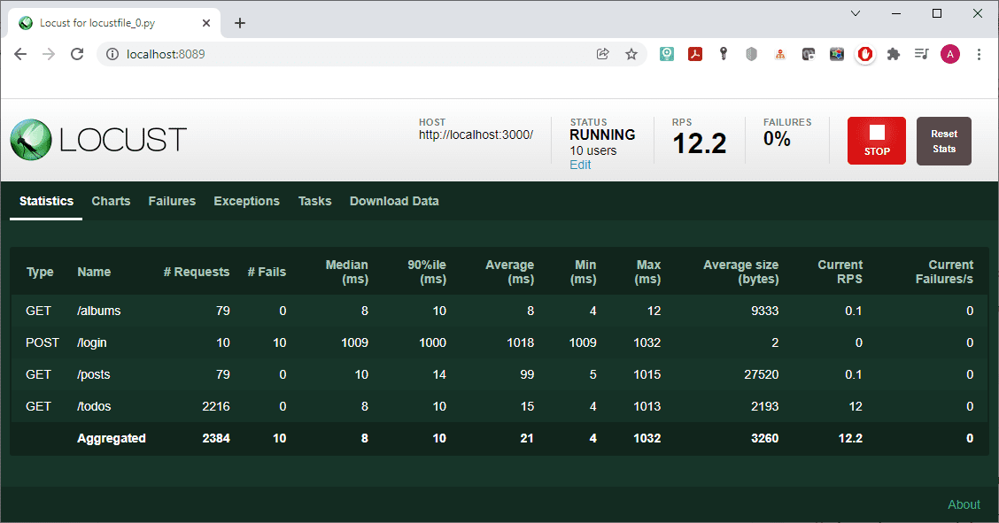

# Projects

This repository contains the following projects that were presented during the Global Azure 2024 in Paris:

## Event 

## Project 1

Description of project 1zure-search-openai-demo-csharp.

Origine solution link : [text](https://github.com/Azure-Samples/azure-search-openai-demo-csharp)

## Project 2

Description of project 2 hunterxhunterapi.

## Project 3

Description of project 3 hunterxhunterfrontend.

## Project 4

Description of project 3 StorageWriter.

## Test Tool :  locust 

 

url : https://locust.io/

